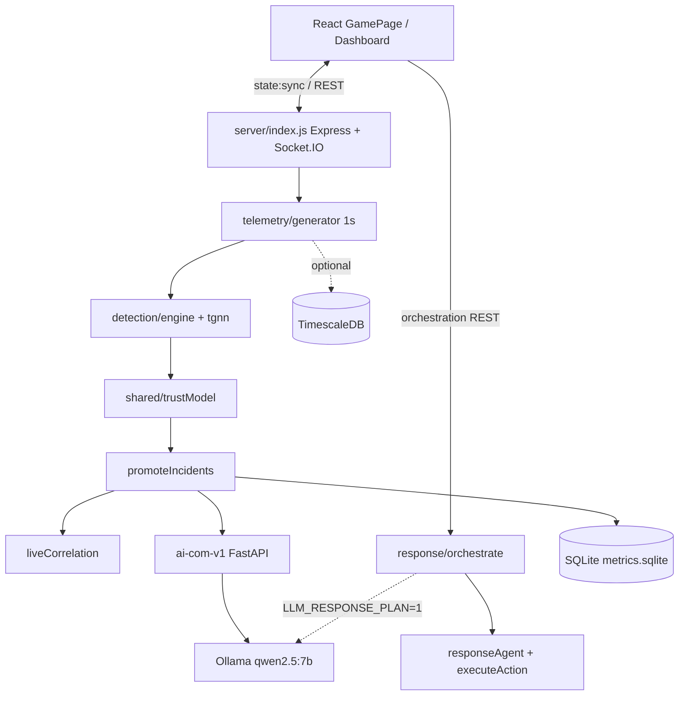
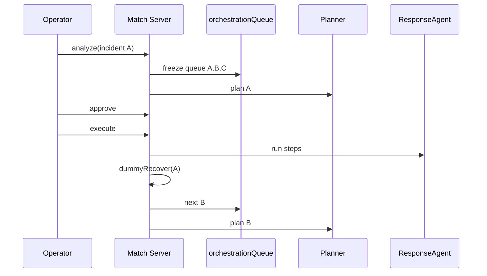

# TrustNet / Project Technical & Product Audit

**Audit date:** 2026-09-05  
**Scope:** Current repository state only (`src/`, `server/`, `shared/`, `ai-com-v1/`, `tele-ingestion/`, `scripts/`, `overfit/`).  
**Method:** Code inspection of live paths. Claims cite file + function. Planned / README-only features are marked explicitly.  
**Product names in code:** npm package `trustnetai`; UI brand string **CityNet AI** (`src/pages/GamePage.jsx`); repo folder / docs often say TrustNet.

---

## 1. Executive System Summary

### What this project is

An AI-assisted **cybersecurity decision-support demo** for interconnected smart-city digital infrastructure. It models the city as a **directed dependency graph**, generates **simulated telemetry**, scores nodes with a **graph residual detector** (internal `tgnn*` modules), blends a **four-component trust score**, promotes **incidents**, optionally explains them via an LLM, and runs a **human-in-the-loop response orchestration** loop (plan → approve → execute → recover → next incident).

It is **not** an autonomous OT controller, not a production SIEM/SOAR, and not fed by real city sensors in the current repo.

### Problem it addresses (as implemented)

Security operators need to see:

1. Which catalog nodes look anomalous relative to an idle embedding baseline  
2. How graph neighbors / dependencies amplify blast context  
3. What safe, registry-constrained response actions to consider  
4. How multiple open incidents can be handled **one at a time** with human approval  

### Who / what it “protects”

A **demo catalog type-graph** of Smart City sector types (energy, water, transport, telecom, government, healthcare, emergency, finance, etc.) laid over a **Bengaluru basemap**. Live graph types: **40** entries in `shared/cityModel/liveGraphTypes.js` (`LIVE_CITY_GRAPH_TYPES`). YAML city model under `overfit/city_model/` provides richer endpoint metadata (~46–60 YAML-backed endpoints depending on parse path; live canvas is the catalog type-graph, not 246 physical endpoints).

### Actual end-to-end pipeline (only stages with code)

```
Simulated telemetry (1s tick)
  → optional Timescale ingest overlay
  → feature frame (14 channels)
  → graph residual detector + hard gates
  → trust blend + risk momentum
  → incident promotion (TGNN seeds only)
  → live correlation groups (open incidents)
  → recovery-impact ranking (counterfactual)
  → async incident explanation (Commander /explain or template)
  → Socket.IO state:sync → Dashboard / Map
  → Orchestrate: Analyze (deterministic playbook plan; optional Ollama plan)
  → Human Approve
  → Response Agent execute (in-memory quarantine / blocks / diagnostics)
  → Dummy recovery of selected incident
  → Sequential queue advance to next active incident
```

Stages **not** present as autonomous production systems: real sensor ingest, MapLibre GIS twin, Isolation Forest, MongoDB, LLM action execution without approval, physical device control.

---

## 2. Complete Architecture

### 2.1 Runtime services (active stack)

| Component | Path | Responsibility | Tech | Active in main demo? |
|-----------|------|----------------|------|----------------------|
| Frontend (Vite/React) | `src/` | Map + defender dashboard; Socket.IO client; orchestration UI | React 19, Vite, Tailwind, `@xyflow/react`, Socket.IO client, Recharts | **YES** (`npm start` / `npm run dev`) |
| Match / room server | `server/index.js` | DEMO room, telemetry loop, detection, incidents, orchestration HTTP, Socket.IO | Node, Express, Socket.IO, better-sqlite3 | **YES** (port **3001**) |
| Shared logic | `shared/` | Trust, TGNN math, presets, response registry, orchestration FSM, finance demo map | ESM JS shared by server + Vite | **YES** |
| AI Commander | `ai-com-v1/` | FastAPI: `/commander/explain` (live), `/analyze`+RAG (lab) | Python, FastAPI, LangGraph, Qdrant optional, Groq/Ollama | **YES** for explain if healthy (port **8000**) |
| Tele-ingestion | `tele-ingestion/` | Persist CitySnapshot to TimescaleDB; recent telemetry API | Node/TS, PostgreSQL/Timescale | **OPTIONAL** (`npm start -- --no-ingest` skips); detection continues without it |
| Ollama | external | Local LLM (`qwen2.5:7b-instruct` default) | Ollama HTTP API | **CONFIG-DEPENDENT**; not started by `npm start` (use `npm run ollama:qwen`) |
| Qdrant | `ai-com-v1/docker-compose.yml` | Vector store for lab RAG | Docker | **OPTIONAL** (`npm start -- --with-rag`); live `/explain` does **not** use RAG |

### 2.2 Component detail

#### Frontend
- **Files:** `src/main.jsx`, `src/App.jsx`, `src/pages/GamePage.jsx`, `src/pages/DashboardPage.jsx`
- **Inputs:** `state:sync`, REST `/rooms/:id/*`
- **Outputs:** Socket emits (graph edits, attack presets, quarantine); orchestration REST
- **Status:** IMPLEMENTED

#### Match server
- **Files:** `server/index.js`, `server/roomStore.js`, `server/telemetry/*`, `server/detection/*`, `server/response/*`, `server/commander/*`, `server/campaign/*`
- **Inputs:** Socket events, HTTP from UI, optional tele-ingestion overlay
- **Outputs:** `state:sync`, SQLite metrics/incidents, Commander explain requests
- **Status:** IMPLEMENTED — single in-memory room `DEMO` (`server/roomStore.js` `DEMO_ROOM_ID`)

#### Detection engine
- **Files:** `server/detection/engine.js` `runDetection`, `server/detection/tgnn.js` `runTgnnAnomaly`, `shared/tgnnCore.js`, `shared/tgnnFeatures.js`, `server/detection/calibrator.js`, `shared/trustConfig.js`
- **Inputs:** Adapted city snapshot + lookback
- **Outputs:** anomaly scores, reasons, promoted incidents
- **Status:** IMPLEMENTED (algorithmic); checkpoint weights in `shared/tgnn_checkpoint.js`

#### Trust engine
- **Files:** `shared/trustModel.js` `blendTrust`, `server/detection/features.js` `computePeerTrustMetrics`
- **Weights:** intrinsic 0.25, peer 0.30, behavioral 0.25, interaction 0.20 (`TRUST_CONFIG.blend`)
- **Status:** IMPLEMENTED

#### Incident / correlation
- **Promotion:** `server/detection/incident.js` `promoteIncidents` — **TGNN seed `anomalyNodeIds` only**
- **Live correlation:** `shared/correlation/liveCorrelation.js` `attachLiveCorrelation`
- **History campaigns:** `server/detection/campaigns/historyCorrelation.js` via REST (not on live `state:sync`)
- **Status:** IMPLEMENTED; live `room.campaigns` forced to `[]` in `publicRoomState`

#### Orchestration / response
- **Files:** `server/response/orchestrate.js`, `shared/response/orchestration.js`, `shared/response/orchestrationQueue.js`, `server/response/responseAgent.js`, `server/response/executeAction.js`, `server/response/recoveryAgent.js`
- **Status:** IMPLEMENTED with **demo dummy recovery** on `/orchestration/execute`

#### AI Commander
- **Live path:** `POST /commander/explain` — evidence restatement, **no RAG** (`server/commander/client.js` → `ai-com-v1`)
- **Lab path:** `POST /commander/analyze` — LangGraph + optional Qdrant; `MockDetectionAdapter` if only `incident_id`
- **Status:** IMPLEMENTED; analyze is **not** the default live incident list path

#### Graph / “map”
- **Graph:** React Flow (`src/features/graph/GraphCanvas.jsx`)
- **Basemap:** CARTO raster tiles (`src/features/graph/cityMap.js`) — **not MapLibre**
- **Status:** IMPLEMENTED (simulated infrastructure on Bengaluru tiles)

#### Databases
| Store | Usage | Survives restart? |
|-------|--------|-------------------|
| TimescaleDB/PostgreSQL | Telemetry + infra via tele-ingestion | Yes (if service/DB up) |
| SQLite `server/data/metrics.sqlite` | Lookback, detection runs, incidents | Yes (local file) |
| In-memory DEMO room | Graph, sim, orchestration, live detection | **No** |
| Qdrant | Lab RAG embeddings | Yes if Docker volume |
| MongoDB | **NOT USED** | N/A |

---

## 3. End-to-End Data Flow

### 3.1 Live match tick (authority path)

| Step | Source | Function / API | Data | Destination |
|------|--------|----------------|------|-------------|
| 1 | `game:start` Socket | `server/index.js` → `startTelemetryLoop` | room phase `playing` | `server/telemetry/generator.js` |
| 2 | 1s interval | `emitTelemetryNow` → `ingestCitySnapshot` | tick++ | same |
| 3 | Snapshot | `buildCitySnapshot` (`server/telemetry/citySnapshot.js`) | per-node metrics + attack overrides | produced snapshot |
| 4 | Optional ingest | `postSnapshot` / `refreshRoomIngestion` (`ingestionClient.js`) | CitySnapshot JSON | tele-ingestion `POST /ingest/snapshot` |
| 5 | Overlay | `overlaySnapshotFromIngested` | ingested or produced | detection input |
| 6 | Adapt | `adaptCitySnapshot` + `attachLookback` | DetectionInput | engine |
| 7 | Detect | `runDetection` → TGNN + gates → `promoteIncidents` | DetectionResult + incidents | `room.detection` |
| 8 | Persist | `persistDetectionIncidents`, `saveDetectionRun` | SQLite rows | `server/metrics/*` |
| 9 | Correlate | `attachLiveCorrelation` | `detection.liveCorrelation` | room |
| 10 | Rank | `attachRecoveryImpact` | recovery scores on incidents | room |
| 11 | Explain (async) | `enqueueIncidentExplanations` | `incident.explanation*` | Commander or template |
| 12 | Broadcast | `broadcastState` → `state:sync` | `publicRoomState(room)` | all sockets in DEMO |

Evidence: `server/telemetry/generator.js` `ingestCitySnapshot`; `server/roomStore.js` `publicRoomState`.

### 3.2 Orchestration path

| Step | Endpoint / UI | Function | Notes |
|------|---------------|----------|-------|
| Analyze | `POST /rooms/:id/orchestration/analyze` | `generateOrchestrationPlanMaybeLlm` | Client `actionIds` **ignored** |
| Approve | `POST …/orchestration/approve` | `approveOrchestrationPlan` | Human gate |
| Execute | `POST …/orchestration/execute` | `executeOrchestrationPlan` then **`completeSelectedIncidentDummyRecovery`** + **`continueOrchestrationQueueAfterRecovery`** | Client plan/actions ignored |
| Verify | `POST …/orchestration/verify` | `verifyOrchestrationPlan` | Observational; separate from dummy recovery shortcut |
| Replan | `POST …/orchestration/replan` | `replanOrchestrationPlanMaybeLlm` | |
| New cycle | `POST …/orchestration/new-cycle` | `startNewOrchestrationCycle` | |

Evidence: `server/index.js` routes ~538–787; `server/response/orchestrate.js`.

### 3.3 Attack injection path

| Step | Event | Function |
|------|-------|----------|
| Manual preset | Socket `campaign:manual` | `applyManualPreset` (`server/campaign/engine.js`) |
| Spread | `attack:spread` | `spreadAttack` |
| Abort | `campaign:abort` | `abortAndClearAttacks` |
| Auto-spread | post-detection | `evaluateAutoSpread` (`server/attack/autoSpread.js`) |

Presets: `shared/attackPresets.js` (`traffic_flood`, `data_exfiltration`, `api_abuse`, `credential_spray`, `iot_lateral`, `internet_facing_compromise`, `credential_compromise`, `botnet_flood`, `malicious_peer`, `service_disruption`, `coordinated_multi_node`, `cascade_propagation`, …).

---

## 4. AI/LLM Architecture

### 4.1 Models and providers

| Path | Provider | Default model | Config |
|------|----------|---------------|--------|
| AI Commander service | `LLM_PROVIDER` default **`ollama`** (`ai-com-v1/.env.example`) | `qwen2.5:7b-instruct` | `ai-com-v1/src/config/settings.py`; Groq optional (`openai/gpt-oss-20b`) with Ollama fallback |
| Match-server explain fallback | Direct Ollama | same default | `OLLAMA_FALLBACK` default **`0` (OFF)**; `OLLAMA_TIMEOUT_MS=60000`; `num_predict=120` (`server/commander/client.js`) |
| Orchestration Planner (optional) | Direct Ollama `/api/chat` | same | `LLM_RESPONSE_PLAN` default **`0` (OFF)**; `temperature: 0`, `num_ctx: 8192`, `num_predict: 1024`, timeout `LLM_PLAN_TIMEOUT_MS` default **90000** (`server/response/llmCommanderClient.js`) |

**Context length:** Planner hardcodes `num_ctx: 8192`. Explain path does **not** set `num_ctx` on the Ollama body. Commander LangChain providers use `temperature=0.0` (`ai-com-v1/src/agent/llm_provider.py`).

### 4.2 What the LLM is responsible for

| Concern | Live path behavior |
|---------|-------------------|
| Incident **explanation** text | LLM via `/commander/explain` when Commander healthy; else template `fallbackExplanation` |
| Orchestration **plan narrative** (`summary`, `attackInterpretation`, `strategy`, action `rationale`/`expectedImpact`) | Only if `LLM_RESPONSE_PLAN=1`; else deterministic playbooks |
| Action **selection** (which registry IDs) | LLM when flag on + validation passes; else playbooks / `buildResponsePlan` |
| **Executing** quarantine / blocks | **Never** — only `executeResponseAction` after human approval |
| Detection / trust / ₹ exposure / severity | **Never** — deterministic upstream |

### 4.3 Prompt / payload (Planner)

- **System:** `LLM_COMMANDER_MERGED_SYSTEM_PROMPT` (`shared/response/llmCommanderPlan.js`) — JSON schema with `summary`, `attackInterpretation`, `review`, `strategy`, `actions[]`.
- **User:** `JSON.stringify(buildLlmCommanderPromptPayload(...))` including incident, telemetry evidence (≤8), graph context, availableActions (full executable registry), relatedIncidents (≤8), authoritative target.
- **Request:** `POST ${OLLAMA_URL}/api/chat` with `format: 'json'`, `stream: false`, `keep_alive: '5m'`.
- **Validation:** `parseLlmCommanderActionsJson` → `validateLlmCommanderActions` / `parseAndValidateLlmCommanderPlan` — registry membership, executability, targets, peers, deps; confidence ∈ [0,1].
- **On failure:** `workflowStatus: LLM_ERROR`; **no invented actions**; HTTP 422 from analyze. Comment in code: never invent actions or execute.

### 4.4 Explain path fields written on incidents

From `server/commander/client.js`:

- `explanation` (string)
- `explanationStatus`: `ready | pending | error | fallback`
- `rag: false` on live explain
- `explanationSource`: `llm-explain` | `template`

### 4.5 Dead / unused LLM wiring

| Item | Status |
|------|--------|
| `callCommanderPlan` → `AI_COMMANDER_URL/commander/plan` | Defined; **not called** on live Analyze (Ollama-direct when flag on) |
| `enqueueCampaignAnalyses` | Present in commander client; **not wired** from `server/index.js` live path (tests) |
| `MockDetectionAdapter` INC-* fixtures | Lab `/analyze` only — **not** live detection |

### 4.6 LLM vs deterministic vs hardcoded (summary)

See §17 matrix. Critical rule for pitches: **detection scores, trust, financial ₹, severity, playbook structure, and quarantine mutations are not LLM outputs.**

---

## 5. Orchestration Architecture

### 5.1 Per-incident workflow statuses

Defined in `shared/response/orchestration.js` `ORCHESTRATION_STATUS`:

`IDLE → ANALYZING → PLAN_READY → AWAITING_APPROVAL → APPROVED → EXECUTING → CONTINUING | VERIFYING → RECOVERED | REPLAN_REQUIRED` (+ `LLM_ERROR`).

Transitions enforced via `ORCHESTRATION_TRANSITIONS`.

### 5.2 Cycle / queue statuses

`ORCHESTRATION_CYCLE_STATUS`: `IDLE | PROCESSING | AWAITING_APPROVAL | RECOVERING | COMPLETED`  
Mapped from workflow by `cycleStatusForWorkflow` (`shared/response/orchestrationQueue.js`).

### 5.3 Multi-incident sequential queue

**IMPLEMENTED** in `shared/response/orchestrationQueue.js` + `server/response/orchestrate.js`.

1. **Queue build** at Analyze: `buildStableOrchestrationQueue(detection, focusIncidentId)`  
   - Active incidents only  
   - Focus incident first (if still active)  
   - Rest: `rankIncidentsByRecoveryPriority` → recoveryPriority DESC → severity DESC → anomalyScore DESC → label ASC  
2. **Planner invocation:** one incident at a time (`queueAdvanceInFlight`; comment: never parallel LLM/planner).  
3. **Human approval** required (`approveOrchestrationPlan`; analyze does not auto-execute).  
4. **Execute** runs `runResponseAgent` / `executeResponseAction` for approved steps.  
5. **Demo recovery:** HTTP execute handler always calls `completeSelectedIncidentDummyRecovery` when execute ok (or “no executable actions”) — quarantines seed node, clears **only that** incident from live list, marks CLEARED in SQLite.  
6. **Advance:** `continueOrchestrationQueueAfterRecovery` → next still-active queued id → reset workflow IDLE preserving queue → `generateOrchestrationPlanMaybeLlm` for next.  
7. **Complete:** cycle `COMPLETED` when no next id.

Evidence: `server/index.js` `POST …/orchestration/execute` lines ~621–663; `applyDummySelectedIncidentRecovery` (~1951).

### 5.4 UI demo pacing vs server truth

`src/features/response/ResponseOrchestrationPanel.jsx` runs **UI-only** `buildDemoResponseAgentExecution` steps at `DEMO_RESPONSE_AGENT_STEP_MS` (1000 ms) **before** calling real `/orchestration/execute`. Comments state dummy pacing is UI-only.

### 5.5 Recovery verification (separate from dummy recovery)

`server/response/recoveryAgent.js` `verifyResponseStep`:

- Checks steps completed, isolate targets quarantined, no new out-of-scope anomalies, residual not worse by **> 0.15**
- **Does not** mutate quarantine  
- On the primary execute HTTP path, dummy recovery + queue advance is the demo shortcut; verify remains available via `/orchestration/verify`

---

## 6. Incident Detection

### 6.1 Telemetry metrics (live encoder inputs)

Four game keys (`shared/telemetryKeys.js` `GAME_METRIC_KEYS`):

1. `packetsPerSecond`  
2. `httpRequestsPerMin`  
3. `filesDownloaded`  
4. `failedLoginsPerMin`  

YAML may list many more metric **names**; they do **not** resize the frozen 14-channel encoder (`setCityYamlFeatureKeys` is a no-op for width).

### 6.2 Feature extraction (14 channels)

`shared/tgnnFeatures.js` `BASE_CITY_FEATURE_KEYS`:  
`telemetryDeviation`, `behavioralDeviation`, `runtimeRisk`, `intrinsicTrust`, `peerTrust`, `interactionTrust`, `criticality`, `inDegree`, `outDegree`, `neighborRisk`, `upstreamStress`, `downstreamStress`, `activityDeviation`, `contextLoad`.

### 6.3 Model / scoring (IMPLEMENTED)

| Piece | Implementation |
|-------|----------------|
| Encoder | Directed in/out mean pool, 2 hops; concat last K=3 spatial vectors; embedDim=8 (`TRUST_CONFIG.tgnn`) |
| Residual | L2 vs idle-window Welford calibrator (`warmupTicks: 15`) |
| Score | Logistic of z-scored residual (`scoreAlpha: 4.5`, `scoreZOffset: 1.25`) → field often aliased `isolationScore` **but not Isolation Forest** |
| Gates | Score ≥ **0.58**, relative/spread/gap rules, telemetry drift ≥ **0.1** OR metric spike ≥ **0.5**, scenario drift (`classifyTgnnScores` in detection path) |

### 6.4 Incident creation

- `promoteIncidents` creates incidents **only** for `anomalyNodeIds` (seeds).  
- Peer / propagated nodes attach as **graph context** on the seed incident, not separate executable episodes (`server/detection/incident.js` comments ~494–496).  
- Severity bands: critical ≥ 0.85, high ≥ 0.7, medium ≥ 0.55 (`TRUST_CONFIG.incident.severity`).  
- Level-1 numeric evidence attached at promotion (`server/detection/incident_evidence.test.js` asserts this).

### 6.5 Attack / simulation (HARDCODED DEMO)

Metric multipliers and floors in presets (`shared/attackPresets.js` + campaign engine). Example patterns: flood PPS multipliers, credential spray login spikes, staged lateral campaigns. This is **demo configuration**, not captured malware telemetry.

### 6.6 Real vs demo classification

| Behavior | Class |
|----------|-------|
| Residual math + gates + calibrator | **Real algorithm** on simulated inputs |
| Attack presets / city-context multipliers | **Hardcoded demo** |
| Timescale persistence | **Real optional DB** |
| Frontend `runTgnnAnomaly` | **Secondary UI fallback**; live authority is server |

---

## 7. Graph / Network / Trust

### 7.1 Graph model

- **Nodes:** React Flow nodes from asset catalog types + operator placement; live types = `LIVE_CITY_GRAPH_TYPES` (40).  
- **Edges:** Directed dependency / communication edges (provider → dependent semantics in correlation docs).  
- **Construction:** Client graph edits + `graph:load`; server validates/stores on room.  
- **Updates:** Socket `graph:*` handlers in `server/index.js`.  
- **NOT PROVEN FROM CODE:** real-world Bengaluru infrastructure GIS layers or official asset inventories. District anchors in `cityMap.js` are **UI layout hints**.

### 7.2 Propagation / blast

- Spread config: `maxHops: 3`, `decayFactor: 0.5`, trustCutoff 65 (`TRUST_CONFIG.spread`).  
- Helpers: `shared/graphPropagation.js`, `shared/propagationRisk.js`, incident-scoped blast in `incident.js`.  
- Attack auto-spread: `server/attack/autoSpread.js` (simulation, capped).

### 7.3 Trust score

`blendTrust` with weights 25/30/25/20. Peer aggregate = **min** neighbor local. Intrinsic caps when injected (28) / quarantined (15). Trust is **posture**, not the anomaly score (README + config).

### 7.4 TGNN / ML claim discipline

| Claim | Verdict |
|-------|---------|
| “Directed GNN encoder + residual + calibrator + gates” | **IMPLEMENTED** |
| “Literature Temporal Graph Network” | **NOT IMPLEMENTED** (internal filename legacy) |
| “Isolation Forest” | **NOT IMPLEMENTED** (`isolationScore` is residual alias) |
| “Online learning / training during match” | **NOT IMPLEMENTED** — frozen checkpoint + idle calibrator; `npm run train:tgnn` is offline script |

---

## 8. Drift / Baseline / Security Logic

| Technique | Status | Evidence |
|-----------|--------|----------|
| Idle-window embedding calibrator (Welford) | **IMPLEMENTED** | `server/detection/calibrator.js`; `warmupTicks: 15` |
| Telemetry / behavioral deviation gates | **IMPLEMENTED (PARTIAL vs full “drift product”)** | `minDeviationRatio`, metric spike gates; evidence codes like `telemetry_drift:*` |
| Residual z-score → logistic | **IMPLEMENTED** | `shared/tgnnCore.js` `residualToScore` |
| EWMA | **NOT FOUND** | — |
| Isolation Forest | **DOCUMENTED ONLY / explicitly denied** | README, docs, UI copy |
| Baseline freeze anti-poisoning product | **PARTIAL** | Calibrator freezes after warmup; skips attack ticks; verify clones detection — not a dedicated poisoning detector |
| Policy drift engine | **NOT FOUND** | — |
| Structural drift engine | **NOT FOUND** as named detector (type priority string exists) | |
| Clustering | **NOT FOUND** in live detection | — |

---

## 9. Response System

### 9.1 Action repository

`shared/response/responseActionRepository.js`:

**Supported (executable):**  
`isolate-node`, `block-peer`, `block-external-communication`, `segment-device`, `revoke-peer-access`, `enforce-policy`, `restore-connectivity`, `restore-peer-access`, `restore-segment`, `capture-device-state`, `snapshot-network-state`, `collect-telemetry-window`, `inspect-peer-history`

**Unsupported:** `disable-camera` (`supported: false`)

### 9.2 Playbooks (deterministic planner)

`shared/response/responsePlaybooks.js`:  
`LATERAL_MOVEMENT`, `POLICY_VIOLATION`, `COMPROMISED_DEVICE`, `EXTERNAL_C2`, `OT_SOFT_CONTAIN`, `CREDENTIAL_ABUSE`, `DEFAULT_CONTAIN`, `RECOVERY`  
Selected via `selectPlaybookId` from detection profile.

### 9.3 Plan build

`shared/response/responsePlan.js` `buildResponsePlan` — deterministic structure, fingerprints, policy status, ordered steps. LLM fields merged when enabled (`llmSummary`, `strategy`, `llmActions`, …).

### 9.4 Execution after human approval

`server/response/executeAction.js` `executeResponseAction` mutates **in-memory room state** only:

| executionTarget | Effect |
|-----------------|--------|
| quarantine / unquarantine | `setNodeQuarantined` |
| block_peer / block_external | peer/external blocks |
| segment / restore_segment | device segment restricted/normal |
| revoke_peer / restore_peer | revoked peers + blocks |
| enforce_policy | allowlist from edges |
| diagnostic | record only |

LLM text never executed. Client-supplied action lists on analyze/execute are **ignored** (injection protection comments in `server/index.js`).

### 9.5 Dummy recovery (demo)

After execute HTTP success: quarantine selected incident endpoint, remove that incident from live detection, clear its anomaly id, SQLite CLEARED — **other incidents untouched**. Action id `dummy-recover-selected` may appear in orchestration execution results.

---

## 10. Frontend Architecture

### 10.1 Shell

- Routes: `/`, `/play` → `GamePage`; `/play/:roomId` redirects to `/play` (room id not a product); `/dashboard` → `/`.  
- Views: **Map** vs **Dashboard** (`?view=dashboard&panel=…`).  
- Brand: **CityNet AI**.

### 10.2 Dashboard panels (`src/features/dashboard/dashboardPanels.js`)

| Panel | Group | Component |
|-------|-------|-----------|
| overview | Monitor | `OverviewPanel.jsx` |
| incidents | Monitor | `IncidentsPanel.jsx` |
| timeline | Monitor | `MonitorTimelinePanel.jsx` / history REST |
| correlation | Monitor | `LiveCorrelationPanel.jsx` |
| fleet | Monitor | `EndpointTable.jsx` |
| commander | Analyze | `CommanderPanel.jsx` |
| orchestrate | Act | `ResponseOrchestrationPanel.jsx` |
| response | Act | `ResponseConsolePanel.jsx` |

### 10.3 State transport

- **Primary:** Socket.IO `state:sync` (`src/multiplayer/useGameRoom.js`, room `DEMO`).  
- **REST:** metrics poll, incident history/campaigns, commander-context/intel/ask, orchestration CRUD-like posts, `/debug/llm-response`.  
- **Local calc:** financial exposure, some trust chrome, overview copy, fleet sparks, demo response-agent playback.

### 10.4 Unused UI assets (present but not mounted)

`KpiStrip.jsx`, `FinancialExposureCard.jsx` default export, `CampaignIntelligence.jsx`, `IncidentTimeline.jsx` (replaced by history timeline), `postCommanderExecute` unused by live UI, `useGameRoom().startGame` unused from GamePage.

---

## 11. Map & Visualization

| Claim | Verdict |
|-------|---------|
| MapLibre | **NOT IMPLEMENTED** — no dependency / imports |
| Visualization | **React Flow** graph + **CARTO** raster tiles (`basemaps.cartocdn.com`) |
| API key | **None** for tiles |
| Geographic scope | Center **12.9716, 77.5946** (Bengaluru); zoom 14; 12×8 tiles |
| Infrastructure | **Simulated / catalog** nodes, not real city asset GIS |
| Incidents / risk on map | Server `detection` highlights via GraphCanvas security scan |

Files: `src/features/graph/cityMap.js`, `CityMapBackground.jsx`, `GraphCanvas.jsx`.

---

## 12. APIs & Communication

### 12.1 Match server HTTP (`server/index.js`)

| Method | Path | Purpose |
|--------|------|---------|
| GET | `/health` | Probes ingest + Commander |
| GET | `/debug/llm-response` | Last LLM plan debug blob |
| GET | `/rooms/:id/metrics` | Recent samples |
| GET | `/rooms/:id/detection` | Latest detection |
| GET | `/rooms/:id/incidents` | Incidents |
| GET | `/rooms/:id/incidents/history` | History |
| GET | `/rooms/:id/incidents/campaigns` | History campaigns |
| GET | `/rooms/:id/incidents/:incidentId` | One incident |
| GET | `/rooms/:id/incidents/:incidentId/commander-context` | Commander context |
| POST | `/rooms/:id/commander/incident-intel` | Intel + knowledge |
| POST | `/rooms/:id/commander/execute` | `executeResponseAction` |
| POST | `/rooms/:id/orchestration/analyze` | Plan (maybe LLM) |
| POST | `/rooms/:id/orchestration/approve` | Approve |
| POST | `/rooms/:id/orchestration/execute` | Execute + dummy recovery + queue |
| POST | `/rooms/:id/orchestration/verify` | Verify |
| POST | `/rooms/:id/orchestration/replan` | Replan |
| POST | `/rooms/:id/orchestration/new-cycle` | Reset cycle |
| PATCH | `/rooms/:id/incidents/:incidentId` | Status / actionsTaken |
| POST | `/rooms/:id/commander/ask` | Ask / knowledge |

### 12.2 Socket.IO

**Inbound:** `room:join`, `room:setCityContext`, `game:start`, `game:reset`, `graph:*`, `sim:patch`, `campaign:manual`, `attack:spread`, `campaign:abort`, `defender:quarantine`, `attack:setSpreadMode`, `disconnect`  

**Outbound:** `state:sync`, `error`

### 12.3 tele-ingestion

`GET /health`, `POST /ingest/snapshot`, `POST /ingest/infrastructure`, `GET /api/infrastructure`, `GET /api/telemetry/recent`, `GET /api/telemetry/history/:endpointId`.

### 12.4 ai-com-v1

`GET /health`, `POST /commander/analyze|explain|ask|knowledge|knowledge/ask|plan|posture`.

---

## 13. Database & Storage

| Store | Schemas / contents | Persistence |
|-------|--------------------|-------------|
| TimescaleDB | Telemetry hypertables + infrastructure (`tele-ingestion`) | Durable if DB up |
| SQLite | lookback samples, detection_runs, incidents, campaign tables (`server/metrics/store.js`) | Durable local file |
| Room Map | nodes, edges, detection, orchestration, hackSimulator | **Lost on restart** |
| JSON/YAML | `overfit/city_model/**`, asset catalog | Static assets |
| Qdrant | `ai_commander_knowledge_v1` | Lab RAG only |
| MongoDB | — | **Not present** |

---

## 14. Security

### Implemented guardrails (code-backed)

1. **Human approval** before response execution (orchestration approve).  
2. **LLM cannot execute** — planning/validation only; mutations only via `executeResponseAction` after approval.  
3. **Client action/plan injection ignored** on analyze/execute/replan HTTP.  
4. **Action registry allowlist** — unknown actionIds rejected.  
5. **OT/ICS safety validation** on Commander **analyze** path (`ai-com-v1` safety nodes) — prefer soft containment language.  
6. **Evidence grounding** for explain — prompts instruct use of numeric facts; Level-1 evidence on incidents.  
7. **Dummy recovery isolates one incident** — does not clear the whole city.  
8. **Secrets** expected via `.env` (do not commit keys).  

### Not production-hardened (honest)

- No multi-tenant auth / RBAC on DEMO room.  
- No mutual TLS between services.  
- Quarantine is **simulation state**, not network ACL on real devices.  
- LLM_RESPONSE_PLAN off by default partly to avoid local resource thrash.  
- `/debug/llm-response` exposes last plan debug info locally.

---

## 15. Demo Flow (judge-facing, matches code)

1. Start stack (`npm start`); optionally `npm run ollama:qwen`.  
2. Open UI → join **DEMO** → Map shows Bengaluru tiles + catalog graph.  
3. Start match (`game:start`) → 1s telemetry + detection.  
4. Attacker applies preset (e.g. flood / lateral) from sidebar.  
5. Telemetry metrics spike → residual + gates → **incident** promoted.  
6. Dashboard → **Incidents** shows card (severity, evidence, “Why it matters” from deterministic `whyItMatters`, simulated ₹ if mapped).  
7. **Live Correlation** may group related open incidents.  
8. Select incident → **Orchestrate** → Analyze → Planner builds plan (playbook default; Ollama if `LLM_RESPONSE_PLAN=1`).  
9. Human reviews → **Approve**.  
10. UI may animate demo Response Agent steps → then **Execute** API.  
11. Response Agent applies in-memory containment; **dummy recovery** clears selected incident; queue plans **next** incident if any.  
12. Timeline/history REST can show persisted lifecycle; Map reflects quarantine / residual state via `state:sync`.

---

## 16. Hardcoded / Demo Data Audit

| Value / class | File | Function / symbol | Why | Demo? |
|---------------|------|-------------------|-----|-------|
| `SERVICE_LAKHS` ₹/lakhs map | `shared/financialExposure.js` | `SERVICE_LAKHS`, `computeFinancialExposure` | FinTech/Smart City illustrative exposure | **YES** (`simulated: true`) |
| Residual band thresholds 70/45 | same | `residualBand` | UI banding | Demo mapping on riskMomentum score |
| `whyItMatters` copy | `shared/incidentIntel.js` | `whyItMatters` | Operator narrative | Deterministic template |
| Attack preset multipliers | `shared/attackPresets.js` | stage compute fns | Controlled anomalies | **YES** |
| City context multipliers | `shared/trustConfig.js` `cityContext` | rush/night/rain/event | Simulated diurnal city | **YES** |
| Bengaluru center / districts | `src/features/graph/cityMap.js` | `MAP_CENTER`, `DISTRICT_ANCHORS` | Visual framing | Geographic backdrop only |
| DEMO room id | `server/roomStore.js` / `useGameRoom.js` | `DEMO` | Single-session hackathon | Demo product choice |
| Mock INC-001… | `ai-com-v1/.../detection_adapter.py` | MockDetectionAdapter | Lab analyze without live room | **YES** |
| `illustrativeImpact` | `server/detection/incident.js` | `illustrativeImpactOf` | Finance-sector index | Simulated, not ₹ |
| UI brand “CityNet AI” | `GamePage.jsx` | header | Product naming | Copy |
| Dummy recovery action | `orchestrate.js` | `dummy-recover-selected` | Demo close-out | **YES** |
| Catalog baselines / PPS fallbacks | asset catalog + fleet UI | baselines | When ingest empty | Labeled catalog baseline |
| Checkpoint / sin-seed fallback | `shared/tgnn_checkpoint.js` | create params | Encoder weights | Model artifact (not “city truth”) |

---

## 17. LLM vs Deterministic Source Matrix

| Feature | Source | LLM? | Deterministic? | Hardcoded? | Notes |
|---------|--------|------|----------------|------------|-------|
| Anomaly / residual score | TGNN + calibrator + gates | No | Yes | Thresholds in config | Field may be named `isolationScore` |
| Trust score | `blendTrust` | No | Yes | Weights hardcoded | |
| Severity | score bands | No | Yes | Config | |
| Incident promotion | `promoteIncidents` | No | Yes | — | Seeds only |
| Evidence numbers | detection | No | Yes | — | Level-1 |
| Incident explanation text | Commander explain / template | **Optional LLM** | Template fallback | — | `rag: false` live |
| Live correlation groups | `attachLiveCorrelation` | No | Yes | Weights in module | Not causality |
| Recovery priority | `attachRecoveryImpact` + rank | No | Yes | — | Counterfactual |
| Financial ₹ exposure | `SERVICE_LAKHS` | No | Yes (sum) | **Yes map** | Always `simulated: true` |
| “Why it matters” | `whyItMatters` | No | Yes | Template | May embed exposure label |
| Orchestration action IDs | Playbook or validated LLM | **Optional** | Default playbook | Registry | Flag default OFF |
| Action rationale / expectedImpact | LLM if enabled else playbook/registry | Optional | Yes | Registry labels | |
| Planner summary / strategy / attackInterpretation | LLM if enabled | Optional | Partial deterministic plan fields | — | |
| Risk / trust in plan UI | Upstream detection | No | Yes | — | |
| Quarantine / blocks | `executeResponseAction` | No | Yes | — | After approve |
| Dummy recovery | `applyDummySelectedIncidentRecovery` | No | Yes | Demo shortcut | |
| Response Agent UI step animation | Frontend demo playback | No | Yes | Timing constants | Before real execute |
| Commander analyze briefing (lab) | LangGraph + RAG | Yes | Safety validators | Mock adapter possible | Not live list path |
| Graph topology | Catalog + user edges | No | — | Catalog types | Simulated city |

---

## 18. Limitations & Gaps

1. **Simulated telemetry** — not live city sensors.  
2. **Dummy / demo recovery** on primary execute path — clears selected incident by quarantine+remove, not full verified OT restore.  
3. **LLM response planning OFF by default** — demos often deterministic playbooks.  
4. **Local Ollama / optional Groq** dependency for LLM features; explain Ollama fallback OFF by default.  
5. **Timescale ingest optional** — detection works without it; “LIVE” socket ≠ ingest healthy.  
6. **Single DEMO room** — `/play/:roomId` is not multi-room SaaS.  
7. **No MapLibre / no real GIS twin.**  
8. **No MongoDB**; limited persistence of orchestration/match state.  
9. **Encoder is miniature residual GNN**, not literature TGN; checkpoint training gain is modest (internal audits warn against overclaiming).  
10. **Financial exposure is illustrative lakhs**, not actuarial loss.  
11. **Live campaigns stripped** from `state:sync` (`campaigns: []`).  
12. **Frontend TGNN** can diverge if used as fallback chrome — server is authority.  
13. **Production auth, RBAC, audit trail, HA** not implemented.  
14. **Qdrant RAG** not on live explain path; empty corpus = degraded lab analyze.  
15. **`callCommanderPlan` / campaign analyze enqueue** dead or test-only relative to live match wiring.

---

## 19. Actual Differentiators (implementation-backed only)

1. **Graph residual detection** (directed encoder + idle calibrator + hard gates) on a city dependency graph — not lone threshold alerts.  
2. **Four-component relational trust** blended with graph neighbor min-peer semantics.  
3. **Seed-scoped incidents** with explicit peer/propagation **context** (not inventing hop paths).  
4. **Live open-incident correlation** with scored reasons (triage, not kill-chain attribution).  
5. **Human-in-the-loop orchestration** with registry-constrained actions and client injection ignored.  
6. **Sequential multi-incident queue** (one planner at a time; recovery priority ordering).  
7. **Strict LLM boundary**: explain/plan text ≠ detection authority ≠ execution authority.  
8. **Integrated demo surface**: map graph + monitor + orchestrate + response in one match loop.  
9. **Simulated economic exposure layer** clearly labeled — connects FinTech stream without fake loss claims.  
10. **Safety-aware action vocabulary** (isolate/segment/monitor vs unqualified “shut down plant”).

---

## 20. Architecture Diagram Specifications

### A. High-level architecture

**NODES:** Browser UI · Match Server · AI Commander · Ollama · Tele-ingestion · TimescaleDB · SQLite · (optional Qdrant)

**ARROWS:**  
UI ↔ Match (Socket.IO `state:sync`, REST)  
Match → Tele-ingestion (HTTP snapshot)  
Match → SQLite  
Match → AI Commander (`/explain`)  
Commander → Ollama/Groq  
Commander → Qdrant (lab only)  
Match → Ollama (optional plan / optional explain fallback)

**PROTOCOLS:** HTTP, Socket.IO, Ollama `/api/chat`, PostgreSQL

### B. Detailed technical architecture



### C. Telemetry → Detection → Incident

**NODES:** buildCitySnapshot → ingest overlay → adaptCitySnapshot → lookback → runTgnnAnomaly → classify gates → promoteIncidents → persist → attachLiveCorrelation → attachRecoveryImpact → enqueue explanations → state:sync

**LABELS:** metrics JSON; DetectionInput; scores; Incident[]; liveCorrelation.groups

### D. AI Planner architecture

**NODES:** Analyze HTTP → begin queue → (if flag) buildLlmCommanderPromptPayload → Ollama chat JSON → parse/validate → merge into buildResponsePlan → AWAITING_APPROVAL  
**ELSE:** selectPlaybookId → buildResponsePlan → AWAITING_APPROVAL  
**FAIL:** LLM_ERROR, no actions invented

### E. Orchestration state machine

**NODES:** IDLE, ANALYZING, PLAN_READY, AWAITING_APPROVAL, APPROVED, EXECUTING, VERIFYING, RECOVERED, REPLAN_REQUIRED, LLM_ERROR  

**ARROWS:** per `ORCHESTRATION_TRANSITIONS` in `shared/response/orchestration.js`

### F. Multi-incident sequential orchestration



### G. Response / recovery lifecycle

Approve → EXECUTING → executeResponseAction mutations → (HTTP path) dummyRecover selected → mark RECOVERED → continue queue → next ANALYZING/PLAN_READY  
Verify endpoint: observational residual/quarantine checks without clearing city-wide state.

### H. Frontend / backend communication

**NODES:** useGameRoom · Dashboard panels · orchestrationView REST helpers · Vite proxy `:3001`  

**EVENTS:** listed in §12.2  

**REST:** listed in §12.1  

---

## 21. PPT-Ready Facts

**Problem:** Cascading cyber risk across interdependent smart-city services is hard to see in siloed alerts.

**Existing gap:** Classic per-device anomaly tools miss graph blast, relational trust, and governed response.

**Proposed solution (as built):** Simulated city graph + residual detector + trust blend + incident correlation + human-approved response orchestration with optional local LLM narrative/planning.

**Architecture:** React map/dashboard · Node match server · optional Timescale · SQLite · FastAPI Commander · optional Ollama/Groq · optional Qdrant.

**Core features:** Live residual detection; trust posture; incidents with evidence; live correlation; financial demo exposure; orchestrate queue; registry actions; quarantine sim.

**AI role:** Restate evidence (`/explain`); optional plan JSON via Ollama; lab RAG analyze — **not** detector of record; **not** executor.

**Security mechanism:** Approval gate; allowlisted actions; ignore client action injection; OT soft-contain vocabulary; evidence-first prompts.

**Demo flow:** Start → attack preset → incident → Orchestrate → approve → execute → recover selected → next incident.

**Stack:** React 19, Vite, Tailwind, React Flow, Socket.IO, Express, better-sqlite3, Timescale/Postgres, FastAPI, LangGraph, Ollama/Groq, Qdrant optional.

**Innovation (honest):** Graph-contextual residual + trust + sequential HITL orchestration in one hackathon demo loop.

**Differentiators:** See §19.

**Limitations:** See §18.

**Future scope (NOT PROVEN as done):** Real sensor ingest, production IAM, MapLibre twin, online learning, non-dummy recovery verification closing loop to OT, multi-tenant rooms, live campaign objects on wire.

---

## 22. Judge Q&A Fact Base

**Why use an LLM?**  
To turn structured detector evidence into readable explanations and (optionally) ordered registry actions with rationales — without replacing detection math.

**Why Ollama?**  
Local/default provider in `ai-com-v1` settings; works offline for demos; Groq optional for speed. Match-server planner talks to Ollama directly when enabled.

**Why this architecture?**  
Keeps detection deterministic and auditable; puts LLM downstream; reuses one DEMO room pipeline for map + SOC panels.

**What if LLM fails?**  
Explain → template fallback. Plan → `LLM_ERROR`, no invented actions; deterministic mode if flag off.

**Can LLM execute a response?**  
**No.** Execution only via approved `executeResponseAction`.

**How is hallucination controlled?**  
Evidence-only explain prompts; JSON schema + registry validation for plans; client action IDs ignored; Level-1 numeric evidence retained on incidents.

**How is the plan validated?**  
`validateLlmCommanderActions` / playbook builder — known actionIds, executable, valid targets/peers/deps.

**Why human approval?**  
Safety and policy: soft containment on critical infrastructure; prevents autonomous OT actions.

**How is risk calculated?**  
Residual logistic score + gates; separate trust blend; riskMomentum on detection; recoveryImpact counterfactual — not a single opaque “AI risk 97”.

**How does graph analysis help?**  
Features include degrees/neighbor stress; blast/propagation context on incidents; correlation uses dependency edges; spread ranking uses graph hops.

**Is telemetry real?**  
**No** — simulated generator + attack overrides; optional DB store of those sims.

**Is infrastructure real?**  
**No** — catalog/YAML model on Bengaluru basemap tiles.

**Is ₹ exposure real?**  
**No** — hardcoded `SERVICE_LAKHS`, always labeled simulated.

**What is actually ML?**  
Frozen directed GNN encoder + residual calibrator scoring. Not Isolation Forest / literature TGN. LLM is separate NLP layer.

**What is deterministic?**  
Gates, trust blend, promotion, correlation, playbooks, execution mutations, finance map, dummy recovery, queue ordering.

**How does this scale?**  
**NOT PROVEN FOR PRODUCTION SCALE.** Single in-memory room, 1s full-graph tick — hackathon demo sizing.

**Multiple incidents?**  
Sequential queue: focus first, then recovery priority; one planner at a time.

**Prevent one incident affecting another?**  
Dummy recovery clears **selected** incident only; queue skips completed; validation scopes targets; correlation is advisory.

**Different from SIEM/SOAR?**  
Graph residual + trust + city dependency framing + HITL orchestration in a live sim — not a log warehouse or enterprise playbook platform. Do not claim SIEM replacement.

**Production requirements (future):** Real telemetry adapters, authZ, durable orchestration, non-sim actuators with change control, model monitoring, HA, audit, hardened APIs — **future scope**.

---

## 23. File-Level Reference Map

| Claim | Location |
|-------|----------|
| Stack startup | `scripts/start-stack.mjs` |
| Match entry / routes / sockets | `server/index.js` |
| Public sync shape | `server/roomStore.js` `publicRoomState` |
| Telemetry tick | `server/telemetry/generator.js` `ingestCitySnapshot` |
| Snapshot build | `server/telemetry/citySnapshot.js` `buildCitySnapshot` |
| Detection | `server/detection/engine.js` `runDetection` |
| TGNN | `server/detection/tgnn.js`, `shared/tgnnCore.js`, `shared/tgnnFeatures.js` |
| Calibrator | `server/detection/calibrator.js` |
| Config thresholds | `shared/trustConfig.js` |
| Incidents | `server/detection/incident.js` `promoteIncidents` |
| Correlation | `shared/correlation/liveCorrelation.js` `attachLiveCorrelation` |
| Recovery impact | `shared/recovery/recoveryImpact.js` `attachRecoveryImpact` |
| Explain enqueue | `server/commander/client.js` `enqueueIncidentExplanations` |
| Orchestrate + dummy recovery + queue advance | `server/response/orchestrate.js` |
| Queue helpers | `shared/response/orchestrationQueue.js` |
| Status FSM | `shared/response/orchestration.js` |
| LLM plan flag/prompt/validate | `shared/response/llmCommanderPlan.js` |
| Ollama plan client | `server/response/llmCommanderClient.js` `requestLlmCommanderActions` |
| Response agent | `server/response/responseAgent.js` `runResponseAgent` |
| Execute mutations | `server/response/executeAction.js` `executeResponseAction` |
| Verify | `server/response/recoveryAgent.js` `verifyResponseStep` |
| Action registry | `shared/response/responseActionRepository.js` |
| Playbooks | `shared/response/responsePlaybooks.js` |
| Attack presets | `shared/attackPresets.js` |
| Finance demo | `shared/financialExposure.js` |
| Why it matters | `shared/incidentIntel.js` `whyItMatters` |
| Live graph types | `shared/cityModel/liveGraphTypes.js` |
| Map tiles | `src/features/graph/cityMap.js` |
| UI shell | `src/pages/GamePage.jsx`, `DashboardPage.jsx` |
| Orchestration UI | `src/features/response/ResponseOrchestrationPanel.jsx` |
| Commander service | `ai-com-v1/src/main.py`, `api/routes/commander.py` |
| LLM provider | `ai-com-v1/src/agent/llm_provider.py` |
| Settings | `ai-com-v1/src/config/settings.py` |

---

## 24. Final Implementation Status

| Area | Status |
|------|--------|
| Simulated telemetry + attack presets | **IMPLEMENTED** |
| Optional Timescale ingest | **IMPLEMENTED / CONFIG-DEPENDENT** |
| Graph residual detector + gates | **IMPLEMENTED** |
| Trust blend 25/30/25/20 | **IMPLEMENTED** |
| Incident promotion + SQLite persist | **IMPLEMENTED** |
| Live correlation | **IMPLEMENTED** |
| Recovery impact ranking | **IMPLEMENTED** |
| Commander `/explain` | **IMPLEMENTED** (service health dependent) |
| Commander `/analyze` + RAG | **IMPLEMENTED (LAB)**; not live list authority |
| Deterministic orchestration playbooks | **IMPLEMENTED** |
| Ollama response planning | **IMPLEMENTED / OFF BY DEFAULT** |
| Human approval + response agent execution | **IMPLEMENTED** (in-memory sim) |
| Dummy selected-incident recovery + sequential queue | **IMPLEMENTED** |
| Observational verify agent | **IMPLEMENTED** |
| React Flow + CARTO Bengaluru map | **IMPLEMENTED** |
| MapLibre | **NOT IMPLEMENTED** |
| MongoDB | **NOT IMPLEMENTED** |
| Isolation Forest | **NOT IMPLEMENTED** |
| Literature TGN / online learning | **NOT IMPLEMENTED** |
| Real city sensors / real ₹ losses | **NOT IMPLEMENTED** |
| Multi-room SaaS | **NOT IMPLEMENTED** |
| Autonomous physical OT control | **INTENTIONALLY NOT IMPLEMENTED** |

---

*End of audit. This document is intended as factual source material for architecture diagrams, pitch decks, demo scripts, and judge Q&A. Prefer citing §23 paths over restating marketing language.*
