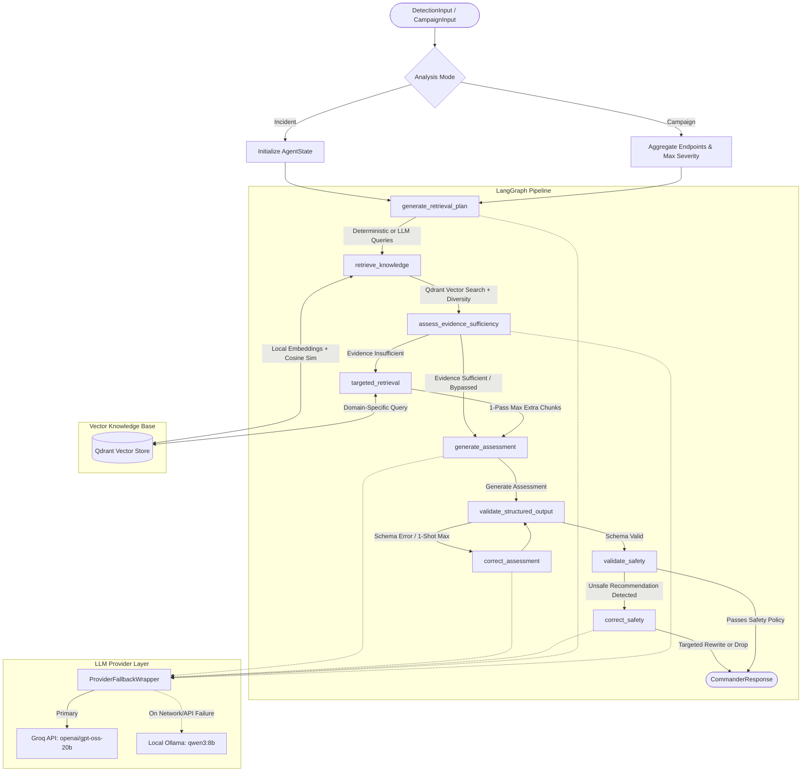

# AI Commander V1

> **V1 Status: Frozen Integration Baseline (Ready with P2 Fixes)**  
> AI Commander V1 is frozen as the downstream decision-support baseline for the Smart City Cyber-Resilience Platform. All core capabilities—individual incident analysis, campaign aggregation, RAG grounding, deterministic call-reduction, OT/ICS safety guardrails, dual-provider failover, and structured output contracts—are verified and benchmarked.

---

## 1. AI Commander V1 Overview

**AI Commander V1** is a specialized, downstream cybersecurity decision-support microservice designed for smart-city cyber-physical infrastructure (water treatment, energy grids, traffic management, healthcare, municipal services, and telecommunications).

```
┌────────────────────────────────────────────────────────┐
│  Upstream Detection & Correlation Systems              │
│  (Temporal Graph Neural Networks / Peer-to-Peer Trust) │
└───────────────────────────┬────────────────────────────┘
                            │
              Structured Incidents / Campaigns
                            │
                            ▼
┌────────────────────────────────────────────────────────┐
│  AI Commander V1 (Downstream Decision Support)         │
│  • Grounded Assessment  • Evidence Retrieval (RAG)     │
│  • Impact Analysis      • Deterministic OT/ICS Safety  │
└────────────────────────────────────────────────────────┘
```

### Core Responsibilities
- **Downstream Decision Support:** Translates structured alerts into context-aware threat assessments and actionable mitigations.
- **Incident & Campaign Consumption:** Analyzes individual incident events (`DetectionInput`) as well as multi-incident campaign packages (`CampaignInput`) supplied by upstream correlation engines.
- **Authoritative Grounding:** Queries an indexed vector store of domain-specific standards (NIST SP 800-61, NIST SP 800-82, MITRE ATT&CK, CISA, NCIIPC) to prevent LLM hallucinations.
- **Deterministic OT/ICS Safety:** Enforces strict operational continuity rules to prevent catastrophic blind shutdowns of critical physical controllers, SCADA, or PLCs.
- **Dual-LLM Architecture:** Uses Groq Cloud API (`openai/gpt-oss-20b`) as the high-speed primary inference provider with an automatic local fallback to Ollama (`qwen3:8b`).

---

## 2. V1 Scope & Non-Goals

To maintain clear microservice boundaries, AI Commander V1 strictly enforces the following scope:

| In Scope (Supported in V1) | Out of Scope / Non-Goals (Intentionally Excluded) |
|---|---|
| **Incident-Mode Analysis:** Single-event triage and evidence-grounded response. | **Autonomous Campaign Discovery:** Clustering or discovering campaigns from raw, unstructured telemetry streams. |
| **Campaign-Mode Analysis:** Consumes upstream-produced `CampaignInput` bundles. | **Upstream Detection Engine:** Modifying or running TGNN (Temporal Graph Neural Network) models. |
| **Deterministic Heuristic Routing:** Bypasses LLM query planning & sufficiency on simple incidents (1 LLM call). | **Live Infrastructure Actuation:** Executing active network blocking, firewall changes, or PLC commands directly on hardware. |
| **Authoritative RAG (Qdrant):** Multi-domain retrieval with category & document round-robin diversity. | **Continuous Multi-Agent Loops:** Unbounded iterative loops or autonomous agent swarms. |
| **Strict Schema Adherence:** Pydantic validation with 1-shot self-correction. | **External Live Search:** Web searching, external OSINT feeds, or real-time internet scraping. |
| **OT/ICS Safety Guardrails:** Deterministic keyword rejection and safe rewrites for control systems. | **Persistent Campaign Database:** V1 is stateless; campaign graph databases and persistence belong to future versions. |
| **Dual Provider Failover:** Groq primary with transparent fallback to Ollama. | **Raw Telemetry Storage:** Storage or indexing of raw packet captures or system logs. |

---

## 3. System Architecture

AI Commander V1 coordinates query planning, vector retrieval, evidence sufficiency evaluation, structured LLM reasoning, output validation, and safety verification via a compiled **LangGraph** state graph.

### Architectural Diagram



---

## 4. LangGraph Workflow & Node Routing

The orchestration logic resides in `src/agent/graph.py`. Each node performs a bounded, deterministic or LLM-assisted task:

| Node Name | Execution Type | Description |
|---|---|---|
| `generate_retrieval_plan` | **Deterministic / LLM** | Generates 1–4 search queries. For simple incidents (single domain, $\le 3$ endpoints), uses deterministic heuristic queries, bypassing the LLM. For complex/campaign incidents, invokes LLM query planning. |
| `retrieve_knowledge` | **Deterministic** | Executes planned queries against Qdrant (`sentence-transformers/all-MiniLM-L6-v2`), deduplicates chunks, and applies round-robin diversity filtering across categories and documents. |
| `assess_evidence_sufficiency` | **Deterministic / LLM** | Evaluates whether retrieved evidence covers the required incident domains. Bypasses LLM if minimum score, chunk count, category diversity, and domain coverage are satisfied. |
| `targeted_retrieval` | **Deterministic** | Executes up to 2 targeted queries for missing domains if sufficiency fails. **Strictly bounded to at most 1 pass.** |
| `generate_assessment` | **LLM Reasoning** | Generates the complete assessment, severity, impact, evidence citations, and recommendations adhering strictly to `CommanderResponse`. |
| `validate_structured_output` | **Deterministic** | Parses and validates the raw LLM output against Pydantic schema contracts. Normalizes field formatting (e.g. integer page extraction). |
| `correct_assessment` | **LLM (1-Shot)** | If Pydantic validation fails, prompts the LLM with the exact schema error to fix structural formatting without hallucinating new facts. Bounded to 1 attempt. |
| `validate_safety` | **Deterministic** | Scans recommendations for forbidden OT/ICS disruption keywords (`shut down`, `power off`, `disconnect`, `disable`, `stop`). |
| `correct_safety` | **LLM (1-Shot) / Filter** | Rewrites only the identified unsafe recommendation into a qualified, continuity-preserving action. If the recommendation remains unsafe after rewrite, drops it deterministically. |

### Call-Count Paths
- **Simple Incident Path (e.g., INC-001):** Deterministic Planner $\rightarrow$ RAG $\rightarrow$ Deterministic Sufficiency $\rightarrow$ **1 Assessment LLM Call** $\rightarrow$ Deterministic Validation $\rightarrow$ Deterministic Safety $\rightarrow$ End (**Total: 1 LLM Call**).
- **Complex Incident Path (e.g., INC-002, INC-003):** LLM Planner (or Bypassed) $\rightarrow$ RAG $\rightarrow$ LLM Sufficiency $\rightarrow$ Assessment Call (**Total: 2–3 LLM Calls**).
- **Campaign Path (e.g., INC-006):** LLM Planner $\rightarrow$ RAG $\rightarrow$ LLM Sufficiency $\rightarrow$ Assessment Call (**Total: 3 LLM Calls**).

---

## 5. RAG & Grounding

The RAG pipeline (`src/rag/`) grounds LLM reasoning in authoritative cybersecurity literature.

### Vector Store & Embeddings
- **Vector Database:** Qdrant (`http://localhost:6333`, collection: `ai_commander_knowledge_v1`).
- **Embedding Model:** `sentence-transformers/all-MiniLM-L6-v2` (384 dimensions, local inference).
- **Corpus:** 14 authoritative documents and ~5,830 chunks across 7 knowledge categories:
  1. `incident-response` (NIST SP 800-61 Rev 2/3)
  2. `ot-ics` (NIST SP 800-82 Rev 2/3, CISA OT Guidelines)
  3. `smart-city` (NIST CPS Framework, Smart City Cybersecurity)
  4. `iot` (IoT Device Security Guidelines)
  5. `attack-intelligence` (MITRE ATT&CK Enterprise/ICS)
  6. `india` (NCIIPC, CERT-In, National Cyber Security Policy)
  7. `resilience` (Urban Infrastructure Cyber-Resilience Guidelines)

### Diversity & Sufficiency Logic
- **Round-Robin Diversity:** Rather than taking top-$K$ chunks from a single document, competitive candidates are grouped by `(category, document_name)` and selected round-robin to ensure balanced context across IT, OT, and Incident Response.
- **Deterministic Sufficiency Bypass Thresholds:**
  - `SUFFICIENCY_MIN_SCORE = 0.50`
  - `SUFFICIENCY_MIN_EVIDENCE = 3`
  - `SUFFICIENCY_MIN_CATEGORIES = 2`
  - Incident required domains (e.g., `incident-response`, `ot-ics`, `smart-city`) must be fully covered.

### Strict Grounding Hierarchy
Prompts enforce a five-level information hierarchy:
1. **Level 1 — Observed Incident Facts:** Directly supplied in `DetectionInput` / `CampaignInput` (telemetry, endpoints, alerts).
2. **Level 2 — Upstream Correlation:** High-level signals from upstream engines (campaign labels, correlation IDs).
3. **Level 3 — Retrieved Authoritative Guidance:** Standards, benchmarks, and best practices from Qdrant.
4. **Level 4 — Reasonable Inference:** Logical conclusions combining facts with retrieved knowledge.
5. **Level 5 — Hypothesis / Candidate:** Potential explanations requiring investigation.

> **MITRE ATT&CK Rule:** A retrieved MITRE technique (e.g., T0830, T1059) is strictly treated as a **Candidate Hypothesis**. The Commander is barred from asserting technique execution or attacker attribution without direct detection evidence.

---

## 6. OT/ICS Safety Guardrails

In critical infrastructure (water treatment, energy, traffic, healthcare), automated disruption can cause severe physical hazards. AI Commander V1 enforces deterministic safety controls:

1. **Prohibited Actions:** The validator rejects unconditional recommendations containing destructive keywords: `shut down`, `power off`, `disable`, `disconnect`, `stop`, `immediately shut down`.
2. **Approved Continuity Strategies:** Recommendations must emphasize:
   - Network segmentation & isolation of affected VLANs/subnets.
   - Traffic rate-limiting and protocol filtering.
   - Preservation of telemetry, monitoring, and forensic logging.
   - Operator and incident response coordination before physical interventions.
3. **Isolated Safety Correction:** If an unsafe recommendation is detected, `correct_safety` rewrites **only that specific recommendation string**, preserving the assessment, impact, evidence, confidence, and other recommendations completely untouched.

---

## 7. API Usage & Endpoints

### 7.1 Endpoints Summary

| Method | Endpoint | Request Body | Response Model | Description |
|---|---|---|---|---|
| `GET` | `/health` | None | `HealthResponse` | Verifies microservice health and environment. |
| `POST` | `/commander/analyze` | `CommanderRequest` | `CommanderResponse` | Fetches detection via adapter and executes Commander analysis. |

### 7.2 Working `curl` Examples

#### Health Check
```bash
curl -X GET http://localhost:8000/health
```
**Response (HTTP 200):**
```json
{
  "service": "ai-commander",
  "status": "healthy",
  "env": "development"
}
```

#### Incident Analysis
```bash
curl -X POST http://localhost:8000/commander/analyze \
  -H "Content-Type: application/json" \
  -d '{"incidentId": "INC-001"}'
```
**Response (HTTP 200):** Returns full `CommanderResponse` JSON.

#### Error Handling Examples
- **Unknown Incident (HTTP 404):**
  ```bash
  curl -X POST http://localhost:8000/commander/analyze \
    -H "Content-Type: application/json" \
    -d '{"incidentId": "UNKNOWN-999"}'
  ```
  `{"detail": "Detection not found"}`
- **Malformed Request Body (HTTP 422):**
  ```bash
  curl -X POST http://localhost:8000/commander/analyze \
    -H "Content-Type: application/json" \
    -d '{"invalidKey": "INC-001"}'
  ```
  `{"detail": [{"loc": ["body", "incidentId"], "msg": "Field required", "type": "missing"}]}`

---

## 8. Setup & Run

### 8.1 Prerequisites
- **Python:** 3.10, 3.11, or 3.14 (Virtual environment recommended)
- **Docker:** Required for running the local Qdrant vector database
- **Groq API Key:** Required for primary cloud inference (`openai/gpt-oss-20b`)
- **Ollama (Optional):** Required for local fallback (`ollama run qwen3:8b`)

### 8.2 Environment Configuration
Create a `.env` file from the example template:
```bash
cp .env.example .env
```

Configure `.env` parameters:
```ini
APP_NAME=ai-commander
APP_ENV=development
HOST=0.0.0.0
PORT=8000
LOG_LEVEL=INFO

# Provider Selection: "groq" or "ollama"
LLM_PROVIDER=groq

# Groq Primary Settings
GROQ_API_KEY=your_groq_api_key_here
GROQ_MODEL=openai/gpt-oss-20b

# Ollama Fallback Settings
OLLAMA_MODEL=qwen3:8b
OLLAMA_BASE_URL=http://localhost:11434

# Qdrant Vector Store
QDRANT_URL=http://localhost:6333
QDRANT_COLLECTION=ai_commander_knowledge_v1
EMBEDDING_MODEL=sentence-transformers/all-MiniLM-L6-v2
```

> **Security Reminder:** Never commit or hardcode `.env` or API keys. Ensure `.env` is listed in `.gitignore`.

### 8.3 Installation & Startup

1. **Create and Activate Virtual Environment:**
   ```bash
   python3 -m venv venv
   source venv/bin/activate
   ```

2. **Install Dependencies:**
   ```bash
   pip install -r requirements.txt
   ```

3. **Start Qdrant Vector Database:**
   ```bash
   docker compose up -d qdrant
   ```
   *Verify Qdrant web UI is accessible at `http://localhost:6333/dashboard`.*

4. **(Optional) Ingest Knowledge Base:**
   If initializing a fresh Qdrant volume with documents:
   ```bash
   python -m src.rag.ingest --input data/processed --batch-size 256
   ```

5. **Start AI Commander Microservice:**
   ```bash
   uvicorn src.main:app --reload --host 0.0.0.0 --port 8000
   ```
   *Service is available at `http://localhost:8000`.*

---

## 9. Testing & Observability

### 9.1 Running Tests

Execute the test suites via `pytest`:
```bash
# Run all Phase 6 Agent, Campaign, and Provider tests
pytest tests/test_agent.py tests/test_phase_6b.py tests/test_phase_6c_1.py tests/test_phase_6c_2.py

# Run RAG pipeline tests
pytest tests/rag/
```

*Note on `tests/test_commander.py`: This legacy test file from Phase 2/3 assumes an unconditional 3-call mock side-effect sequence and does not account for the Phase 6C-2 deterministic planner/sufficiency bypass on simple incidents.*

### 9.2 Evaluation & Diagnostic Scripts

The repository includes dedicated diagnostic and evaluation tools under `scripts/`:

```bash
# Run single-incident node execution trace (e.g. INC-001, INC-002, INC-006)
python scripts/trace_incident.py INC-001

# Run Phase 6D Adversarial & Stress Evaluation Suite
python scripts/v1_adversarial_evaluation.py

# Run Groq Provider Benchmark
python scripts/groq_benchmark.py
```

### 9.3 Observability & Execution Metrics

Every execution through `CommanderService` records detailed performance metrics in the `AgentState` and structured logs:

```text
--- Timing Summary for INC-001 ---
Query Planning Latency: 0.12ms (Deterministic Bypassed)
Retrieval Latency: 84.15ms
Sufficiency Bypassed: Met criteria (max_score=0.58, 2 cats, 2 docs, covers {'incident-response'})
Assessment Latency: 1622.63ms
Total Request Latency: 1733.66ms
--- Execution Metrics ---
LLM Provider: groq
LLM Model: openai/gpt-oss-20b
Fallback Used: false
Total LLM Calls: 1
Evidence Context Size: 1842 chars
Final Evidence Count: 6 chunks
----------------------------------------
```

### 9.4 Established V1 Benchmarks

| Metric / Scenario | Groq Primary (`openai/gpt-oss-20b`) | Ollama Fallback (`qwen3:8b`) | Notes |
|---|---|---|---|
| **Simple Incident Assessment Latency** | **~1.6 s** | ~45.0 s | **~28x faster inference** |
| **Simple Incident Total Latency (INC-001)** | **~1.7 s** (1 call) | ~46.2 s (1 call) | Bypasses Planner & Sufficiency |
| **Complex Incident Total Latency (INC-002)** | **~5.5 s** (3 calls) | ~140.0 s (3 calls) | 4 endpoints triggered complexity |
| **Campaign Total Latency (INC-006)** | **~5.8 s** (3 calls)* | ~180.0 s (3 calls) | Aggregates 5 endpoints across sectors |
| **Pydantic Schema Validation Pass Rate** | **100%** | **100%** | Zero schema failures on valid runs |
| **OT/ICS Safety Validation Pass Rate** | **100%** | **100%** | Zero destructive recommendations |

*\*Note: Live Groq latencies can experience delays (16s–76s) if hitting free-tier HTTP 429 rate limit backoff windows.*

---

## 10. Project Structure

```
ai-commander/
├── README.md                      # This comprehensive technical reference
├── requirements.txt               # Python package dependencies
├── docker-compose.yml             # Qdrant vector database container setup
├── pytest.ini                     # Pytest configuration
├── .env.example                   # Example environment variables template
├── evaluate.py                    # Legacy evaluation script
│
├── src/                           # Application source code
│   ├── main.py                    # FastAPI entrypoint and router mount
│   ├── api/                       # API route handlers
│   │   └── routes/
│   │       ├── commander.py       # POST /commander/analyze
│   │       └── health.py          # GET /health
│   ├── models/                    # Pydantic data contracts
│   │   ├── commander.py           # CommanderRequest, CommanderResponse, Evidence
│   │   └── detection.py           # DetectionInput, CampaignInput, Severity, DetectionType
│   ├── services/                  # Business logic orchestration
│   │   └── commander_service.py   # CommanderService orchestrating LangGraph
│   ├── agent/                     # LangGraph agent orchestration & reasoning
│   │   ├── graph.py               # Core StateGraph, nodes, routing & safety validators
│   │   ├── prompts.py             # System prompts, grounding hierarchy & query guidelines
│   │   ├── models.py              # RetrievalPlan, EvidenceSufficiency, AgentState models
│   │   └── llm_provider.py        # GroqProvider, OllamaProvider, ProviderFallbackWrapper
│   ├── adapters/                  # Detection ingestion adapters
│   │   └── detection_adapter.py   # DetectionAdapter interface & MockDetectionAdapter (INC-001..006)
│   ├── config/                    # Application settings
│   │   └── settings.py            # Pydantic Settings loading from .env
│   └── rag/                       # Retrieval-Augmented Generation subsystem
│       ├── retriever.py           # VectorRetriever with multi-domain & diversity logic
│       ├── ingest.py              # Knowledge base chunk ingestion into Qdrant
│       ├── embeddings/            # Embedding providers (Local MiniLM)
│       └── vectorstore/           # Qdrant client store abstraction
│
├── tests/                         # Test suites
│   ├── test_agent.py              # LangGraph node tests
│   ├── test_phase_6b.py           # Campaign mode & safety correction preservation tests
│   ├── test_phase_6c_1.py         # Dual provider & fallback wrapper unit tests
│   ├── test_phase_6c_2.py         # Complexity classifier & routing tests
│   ├── test_commander.py          # API route unit tests
│   ├── test_health.py             # Health endpoint tests
│   └── rag/                       # Chunking, metadata, cleaner & vector tests
│
├── scripts/                       # Benchmarking, diagnostics & evaluation tools
│   ├── trace_incident.py          # Node-level trace execution tool for any incident
│   ├── v1_adversarial_evaluation.py# Phase 6D 11-case adversarial test harness
│   ├── groq_benchmark.py          # Comparative latency benchmark tool
│   └── llm_call_diagnostic.py     # Call-count diagnostic tool
│
└── data/                          # Data storage & evaluation records
    ├── knowledge/                 # Source cybersecurity guidance documents
    └── processed/                 # Tokenized JSON knowledge chunks
```
